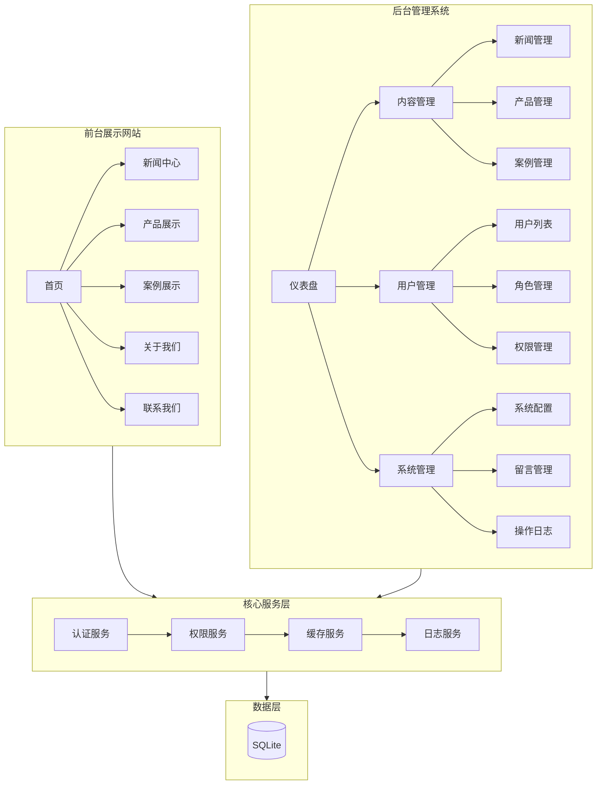
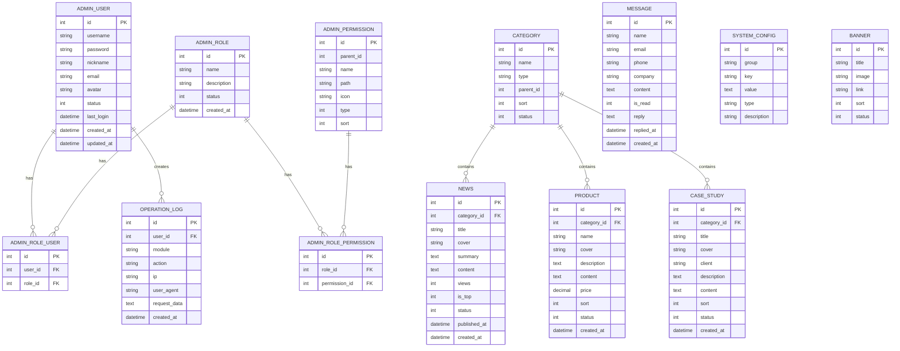

# 企业网站管理系统 - 项目设计文档

## 1. 系统架构



## 2. ER 图



## 3. 接口清单

### 3.1 后台管理接口

#### 认证模块 (AuthController)
| 方法 | 路径 | 描述 |
|------|------|------|
| GET | /admin/login | 登录页面 |
| POST | /admin/login | 登录验证 |
| GET | /admin/logout | 退出登录 |
| GET | /admin/captcha | 获取验证码 |

#### 仪表盘 (DashboardController)
| 方法 | 路径 | 描述 |
|------|------|------|
| GET | /admin/dashboard | 仪表盘首页 |

#### 用户管理 (UserController)
| 方法 | 路径 | 描述 |
|------|------|------|
| GET | /admin/user | 用户列表 |
| GET | /admin/user/create | 创建用户页面 |
| POST | /admin/user/save | 保存用户 |
| GET | /admin/user/edit/:id | 编辑用户页面 |
| POST | /admin/user/update/:id | 更新用户 |
| POST | /admin/user/delete/:id | 删除用户 |
| POST | /admin/user/status/:id | 更改状态 |

#### 角色管理 (RoleController)
| 方法 | 路径 | 描述 |
|------|------|------|
| GET | /admin/role | 角色列表 |
| GET | /admin/role/create | 创建角色页面 |
| POST | /admin/role/save | 保存角色 |
| GET | /admin/role/edit/:id | 编辑角色页面 |
| POST | /admin/role/update/:id | 更新角色 |
| POST | /admin/role/delete/:id | 删除角色 |
| GET | /admin/role/permission/:id | 分配权限页面 |
| POST | /admin/role/permission/:id | 保存权限 |

#### 新闻管理 (NewsController)
| 方法 | 路径 | 描述 |
|------|------|------|
| GET | /admin/news | 新闻列表 |
| GET | /admin/news/create | 创建新闻页面 |
| POST | /admin/news/save | 保存新闻 |
| GET | /admin/news/edit/:id | 编辑新闻页面 |
| POST | /admin/news/update/:id | 更新新闻 |
| POST | /admin/news/delete/:id | 删除新闻 |

#### 产品管理 (ProductController)
| 方法 | 路径 | 描述 |
|------|------|------|
| GET | /admin/product | 产品列表 |
| GET | /admin/product/create | 创建产品页面 |
| POST | /admin/product/save | 保存产品 |
| GET | /admin/product/edit/:id | 编辑产品页面 |
| POST | /admin/product/update/:id | 更新产品 |
| POST | /admin/product/delete/:id | 删除产品 |

#### 案例管理 (CaseController)
| 方法 | 路径 | 描述 |
|------|------|------|
| GET | /admin/case | 案例列表 |
| GET | /admin/case/create | 创建案例页面 |
| POST | /admin/case/save | 保存案例 |
| GET | /admin/case/edit/:id | 编辑案例页面 |
| POST | /admin/case/update/:id | 更新案例 |
| POST | /admin/case/delete/:id | 删除案例 |

#### 留言管理 (MessageController)
| 方法 | 路径 | 描述 |
|------|------|------|
| GET | /admin/message | 留言列表 |
| GET | /admin/message/view/:id | 查看留言 |
| POST | /admin/message/reply/:id | 回复留言 |
| POST | /admin/message/delete/:id | 删除留言 |

#### 系统配置 (ConfigController)
| 方法 | 路径 | 描述 |
|------|------|------|
| GET | /admin/config | 系统配置页面 |
| POST | /admin/config/save | 保存配置 |

#### 操作日志 (LogController)
| 方法 | 路径 | 描述 |
|------|------|------|
| GET | /admin/log | 日志列表 |
| POST | /admin/log/clear | 清空日志 |

### 3.2 前台展示接口

#### 首页 (IndexController)
| 方法 | 路径 | 描述 |
|------|------|------|
| GET | / | 网站首页 |
| GET | /about | 关于我们 |
| GET | /contact | 联系我们 |
| POST | /message | 提交留言 |

#### 新闻 (NewsController)
| 方法 | 路径 | 描述 |
|------|------|------|
| GET | /news | 新闻列表 |
| GET | /news/:id | 新闻详情 |

#### 产品 (ProductController)
| 方法 | 路径 | 描述 |
|------|------|------|
| GET | /product | 产品列表 |
| GET | /product/:id | 产品详情 |

#### 案例 (CaseController)
| 方法 | 路径 | 描述 |
|------|------|------|
| GET | /case | 案例列表 |
| GET | /case/:id | 案例详情 |

## 4. UI/UX 规范

### 4.1 色彩方案

```scss
// 主色调
$primary-color: #1890ff;        // 品牌蓝
$primary-hover: #40a9ff;        // 悬停态
$primary-active: #096dd9;       // 激活态

// 辅助色
$success-color: #52c41a;        // 成功绿
$warning-color: #faad14;        // 警告黄
$error-color: #ff4d4f;          // 错误红
$info-color: #1890ff;           // 信息蓝

// 中性色
$text-primary: #262626;         // 主文字
$text-secondary: #595959;       // 次要文字
$text-placeholder: #bfbfbf;     // 占位符
$border-color: #d9d9d9;         // 边框
$background-color: #f5f5f5;     // 背景
$white: #ffffff;                // 纯白

// 后台专用
$sidebar-bg: #001529;           // 侧边栏背景
$sidebar-text: #ffffffa6;       // 侧边栏文字
$header-bg: #ffffff;            // 头部背景
```

### 4.2 字体规范

```scss
// 字体族
$font-family: -apple-system, BlinkMacSystemFont, 'Segoe UI', Roboto, 'Helvetica Neue', Arial, 'Noto Sans', sans-serif;

// 字号
$font-size-xs: 12px;
$font-size-sm: 13px;
$font-size-base: 14px;
$font-size-lg: 16px;
$font-size-xl: 18px;
$font-size-xxl: 20px;
$font-size-title: 24px;
$font-size-hero: 36px;

// 行高
$line-height-base: 1.5;
$line-height-lg: 1.75;
```

### 4.3 间距规范

```scss
$spacing-xs: 4px;
$spacing-sm: 8px;
$spacing-md: 16px;
$spacing-lg: 24px;
$spacing-xl: 32px;
$spacing-xxl: 48px;
```

### 4.4 圆角规范

```scss
$border-radius-sm: 2px;
$border-radius-base: 4px;
$border-radius-lg: 8px;
$border-radius-xl: 12px;
$border-radius-round: 50%;
```

### 4.5 阴影规范

```scss
$shadow-sm: 0 1px 2px rgba(0, 0, 0, 0.05);
$shadow-base: 0 2px 8px rgba(0, 0, 0, 0.08);
$shadow-lg: 0 4px 16px rgba(0, 0, 0, 0.12);
$shadow-xl: 0 8px 24px rgba(0, 0, 0, 0.16);
```

### 4.6 响应式断点

```scss
$breakpoint-xs: 480px;
$breakpoint-sm: 576px;
$breakpoint-md: 768px;
$breakpoint-lg: 992px;
$breakpoint-xl: 1200px;
$breakpoint-xxl: 1600px;
```

## 5. 安全策略

### 5.1 认证安全
- 密码使用 bcrypt 加密存储
- Session 有效期 2 小时
- 登录失败 5 次锁定 15 分钟
- 验证码防暴力破解

### 5.2 权限控制
- RBAC 角色权限模型
- 中间件统一鉴权
- 操作日志全记录

### 5.3 数据安全
- SQL 预处理防注入
- XSS 输出转义
- CSRF Token 验证
- 文件上传类型限制

## 6. 缓存策略

| 缓存项 | 过期时间 | 说明 |
|--------|----------|------|
| 系统配置 | 1小时 | 配置更新时主动清除 |
| 权限列表 | 30分钟 | 权限变更时清除 |
| 分类数据 | 1小时 | 分类变更时清除 |
| 页面缓存 | 10分钟 | 前台列表页 |
